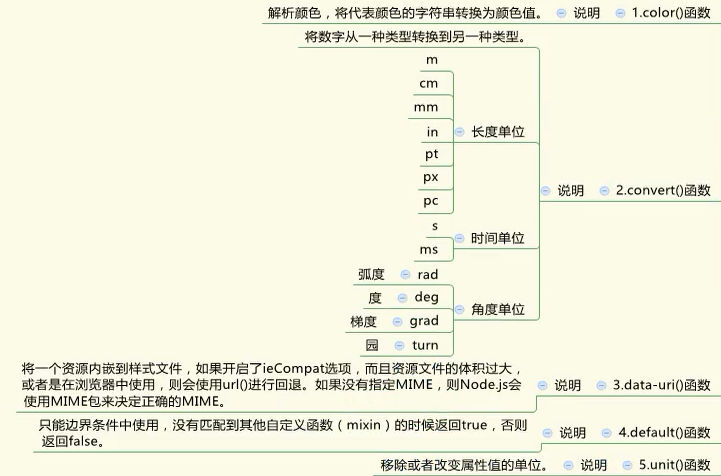
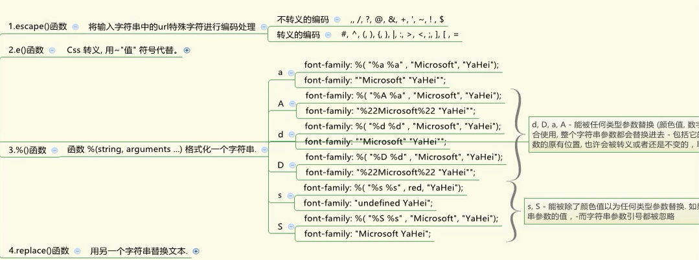
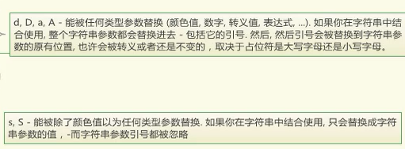
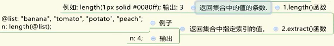
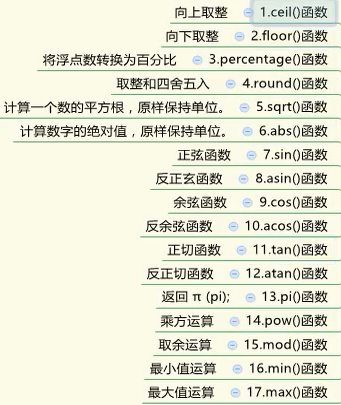
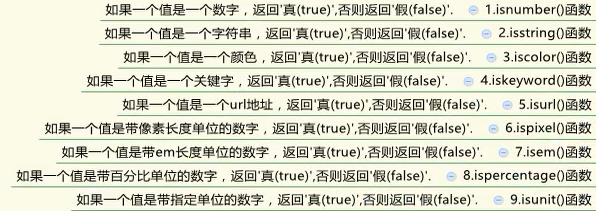
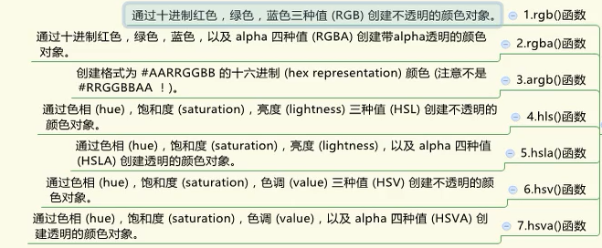
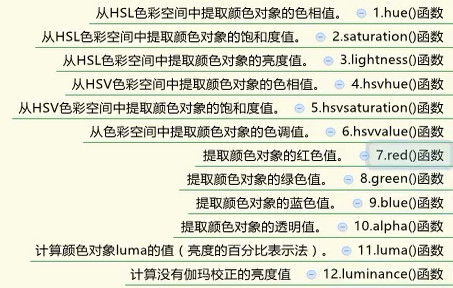
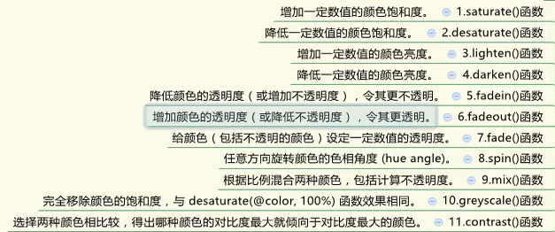
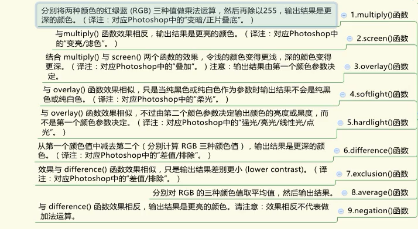

## LESS学习笔记

​	LESS 是动态的样式表语言，通过简洁明了的语法定义，使编写 CSS 的工作变得非常简单，本质上，LESS 包含一套自定义的语法及一个解析器。[中文官网](http://lesscss.cn/) [英文官网](http://lesscss.org/)

demo:style.less

```less
.conten {
  ul{
    list-style: none;
  }
  li{
    height: 25px;
    line-height: 25px;
    padding-left: 15px;
    background: url("arr.jpg") no-repeat center left;
    a{
      text-decoration: none;
      color: #535353;
      font-family: microsoft yahei, Arial, Simsun, "Arial Unicode MS", Mingliu, Helvetica;
    }
  }
}
```

### 1 安装和命令行编译

1、安装Nodejs环境

2、打开控制台（cmd），执行`npm install -g less` (验证 lessc -v)

3、命令行编译 

​	输出结果到控制台中：`lessc path/input.less`

​	输出结果到指定文件中：`lessc path/input.less path/output.css`

### 2  Less编译工具

​	浏览器只能识别CSS，LESS只是用来提升CSS可维护性的一个工具，所最终需要将LESS编译成CSS，然而通过命令行编译效率比较低下，一般都会借助于工具来完成编译，

- sublime_text，sublime_text默认并不支持LESS的编译操作，需要安装插件实现。

    1、执行npm install -g less-plugin-clean-css（使用sublime_text才用）

    2、ctrl+shit+p打开命令面板

    3、输入install package然后回车

    4、安装 LESS、lessc、Less2Css三个插件

    5、alt+s快捷键即可实现编译

- Koala 

    - 下载网址：<http://koala-app.com/>
    - 安装：一路next
    - 编译：直接将项目目录拖放到koala软件中即可
    - 选择输出方式：正常/压缩

- winless

- 在线工具：http://tool.oschina.net/less

- vscode插件

### 3  浏览器中使用

​	如果不想在测试时每次运行都先编译一次less文件，则可以引入一个less.js文件，实现实时的解析，而不必每次修改都要编译，最后完成所有开发任务后，再通过编辑器编译成css文件。

1、引入xx.less文件；

注意：rel属性必须指定成stylesheet/less，并且styles.less要先于less.js引入。

2、然后引入less.js/less.min.js（[下载地址](https://raw.github.com/less/less.js/v2.5.3/dist/less.min.js)）

```html
<link rel="stylesheet/less" type="text/css" href="styles.less" />
<script src="less.min.js"></script>
```

注意：必须以服务器方式访问，webstrom自带服务器功能也可以使用ghostlab调试工具的服务器。

### 4  语法

#### 4.1  注释

- 双斜线注释：编译后不会出现在css文件中

- /\*···\*/注释：编译后会出现在css文件中

#### 4.2  变量

格式：

声明：@变量名: 值，定义完成后可以重复使用

普通变量使用：@变量名

作为选择器和属性名的变量使用：@{变量名}

变量作用域：就近原则

变量延迟加载：可以在使用后声明，定义多个同名变量时遵守就后原则

```less
//定义变量
@green: #801f77; 
@baise:white;

header,footer{
  background: @green; //作为普通变量使用
  h1{
    color: @baise;
  }
}

//作为选择器和属性名的变量
@kuandu:width;

.@{kuandu}{
  @{kuandu}:150px
}

//作为URL的变量
@imgurl:"https://www.baidu.com/img/";
header{
  background: @green url("@{imgurl}bdlogo.png");
  height: 500px;
}

//定义多个相同名称的变量时
@var: 0;

.class {
  @var: 1;
    .brass {
      @var: 2;
      three: @var;  //这是的值是3
      @var: 3;
    }
  one: @var;  //这是的值是1
}

```

编译结果

```css
header,
footer {
  background: #801f77;
}
header h1,
footer h1 {
  color: white;
}
.width {
  width: 150px;
}
header {
  background: #801f77 url("https://www.baidu.com/img/bdlogo.png");
  height: 500px;
}
.class {
  one: 1;
}
.class .brass {
  three: 3;
}
```


#### 4.3  混合

我们可以像使用函数一样来使用CSS，**混合调用时如果同时使用important关键字时，则混合中的所有样式都会应用到important的优先级**

```less
//定义基本混合，编译后这块内容会出现在css文件中
.font_hn{
  color: red;
  font-family: microsoft yahei, "黑体", Arial, Simsun, "Arial Unicode MS", Mingliu, Helvetica;
}
h1{
  font-size: 28px;
  .font_hn;//调用混合相当于将混合中的代码复制到此处
}
h2{
  font-size: 24px;
  .font_hn;
}
//不带输出的混合，类名后面使用()，编译后这块内容不会出现在css文件中
.font_hn(){
  color: red;
  font-family: microsoft yahei, "黑体", Arial, Simsun, "Arial Unicode MS", Mingliu, Helvetica;
}
h1{
  font-size: 28px;
  .font_hn;
}
h2{
  font-size: 24px;
  .font_hn;
}

//带选择器的混合
.my-hover-mixin {
  &:hover {
    border: 1px solid red;
  }
}
button {
  .my-hover-mixin();
}
h1{
  .my-hover-mixin();
}

//带参数的混合
.border(@color){
  border: 1px solid @color;
}
h1{
  &:hover{
    .border(green);
  }
}
h2{
  &:hover{
    .border(#000);
  }
}
//带参数并且有默认值的混合
.border_you(@color:red){
  border: 1px solid @color;
}
h1{
  &:hover{
    .border_you();
  }
}
h2{
  &:hover{
    .border_you(yellow);
  }
}
```

编译结果：

```css
.font_hn {
  color: red;
  font-family: microsoft yahei, "黑体", Arial, Simsun, "Arial Unicode MS", Mingliu, Helvetica;
}
h1 {
  font-size: 28px;
  color: red;
  font-family: microsoft yahei, "黑体", Arial, Simsun, "Arial Unicode MS", Mingliu, Helvetica;
}
h2 {
  font-size: 24px;
  color: red;
  font-family: microsoft yahei, "黑体", Arial, Simsun, "Arial Unicode MS", Mingliu, Helvetica;
}
h1 {
  font-size: 28px;
  color: red;
  font-family: microsoft yahei, "黑体", Arial, Simsun, "Arial Unicode MS", Mingliu, Helvetica;
}
h2 {
  font-size: 24px;
  color: red;
  font-family: microsoft yahei, "黑体", Arial, Simsun, "Arial Unicode MS", Mingliu, Helvetica;
}
.my-hover-mixin:hover {
  border: 1px solid red;
}
button:hover {
  border: 1px solid red;
}
h1:hover {
  border: 1px solid red;
}
h1:hover {
  border: 1px solid #008000;
}
h2:hover {
  border: 1px solid #000000;
}
h1:hover {
  border: 1px solid #ff0000;
}
h2:hover {
  border: 1px solid #ffff00;
}
```

多参数混合：参数之间可以使用分号和逗号分隔，但是推荐使用分号，因为逗号还可以解释为css列表分隔符。

即：当参数列表中只包含逗号分隔符时，以逗号作为参数分隔符，如果同时包含两种分隔符，则以分号作为参数分隔符。

```less
//带多个参数的混合
.mixin(@color; @padding:5px; @margin: 2) {
  color: @color;
  padding: @padding;
  margin: @margin @margin @margin @margin;
 }
 
 .div1{
  .mixin(red;)
 }
 
 .div2 {
  .mixin(1,2,3;4px, 6px;132);
 }
 .div3 {
  .mixin(1,2,3);
 }
 .div4 {
   .mixin(1,2,3;);
 }

 //如果传参的括号里面全部都是以“，”分割，那么会依次传给各个参数值，
 //如果传参的括号里面既有“，”又有“；”那么，会把“；”前面的看作一个整体，传给一个参数值
```

编译结果(本例仅作为演示，并非符合逻辑的代码）

```css
.div1 {
  color: red;
  padding: 5px;
  margin: 2 2 2 2;
}
.div2 {
  color: 1, 2, 3;
  padding: 4px, 6px;
  margin: 132 132 132 132;
}
.div3 {
  color: 1;
  padding: 2;
  margin: 3 3 3 3;
}
.div4 {
  color: 1, 2, 3;
  padding: 5px;
  margin: 2 2 2 2;
}

```

多个同名不同参数个数的混合:根据调用时参数个数（包括有默认值的参数）进行匹配

```less
.mixin(@color) {
  color: @color;
 }
 .mixin(@color; @padding:2) {
  color: @color;
  padding: @padding;
 }
 .mixin(@color; @padding; @margin: 2) {
  color: @color;
  padding: @padding;
  margin: @margin @margin @margin @margin;
 }
 .some .selector div {
  .mixin(#008000);
 }
```

编译结果：

```css
.some .selector div {
  color: #008000;
  padding: 2;
}
```

实参关联形参：

在混合调用时，如果想不按形参顺序传入实参，则需要指定实参关联的形参名

```less
//命名参数
.mixin(@color: black; @margin: 10px; @padding: 20px) {
  color: @color;
  margin: @margin;
  padding: @padding;
}

.class1 {
  .mixin(@margin: 20px; @color: #33acfe);
}
.class2 {
  .mixin(#efca44; @padding: 40px);
}
.class3{
  .mixin(@padding: 80px;)
}
```

编译结果：

```css
.class1 {
  color: #33acfe;
  margin: 20px;
  padding: 20px;
}
.class2 {
  color: #efca44;
  margin: 10px;
  padding: 40px;
}
.class3 {
  color: black;
  margin: 10px;
  padding: 80px;
}

```

@arguments:代表所有的可变参数

```less
.border(@x:solid,@c:red){
  border: 21px @arguments;
}
.div1{
  .border(solid);
}
```

编译结果：

```css
.div1 {
  border: 21px solid red;
}
```

匹配模式:

```less
.border(all,@w: 5px){
  border-radius: @w;
}
.border(t_l,@w:5px){
  border-top-left-radius: @w;
}
.border(t_r,@w:5px){
  border-top-right-radius: @w;
}
.border(b-l,@w:5px){
  border-bottom-left-radius: @w;
}
.border(b-r,@w:5px){
  border-bottom-right-radius: @w;
}

footer{
  .border(t_l,10px);
  .border(b-r,10px);
  background: #33acfe;
}
```

编译结果：

```css
footer {
  border-top-left-radius: 10px;
  border-bottom-right-radius: 10px;
  background: #33acfe;
}
```

返回值：

```less
.js(@x, @y) {
  @average: ((@x + @y) / 2);
  @he:(@x + @y);
}
div {
  .js(16px, 50px);
  padding: @average;
  margin: @he;
}
```

编译结果：

```csss
div {
  padding: 33px;
  margin: 66px;
}

```

3、嵌套

嵌套可以非常方便的管理我们的CSS层级关系

```less
//传统写法
header{
 width: 960px;
}
header h1 {
 font-size: 18px;
 color: green;
}
header .logo{
 width: 300px;
 height: 150px;
 background: darkred;
}
header .logo:hover{
 background: forestgreen;
}

//less写法
header{
 width: 960px;
 h1{
   font-size: 18px;
   color: green;
 }
 .logo{
   width: 300px;
   height: 150px;
   background: darkred;
   &:hover{
     background: forestgreen;
   }
 }
}
```

使用&符号表示父级选择器

```less
.a{
  .b{
    .c&{
      color: 123;
    }
  }
}

p, a, ul, li {
  border-top: 2px dotted #366;
  &   & {
    border-top: 0;
  }
}

a , b ,c{
  &   &  & {
    border-top: 0;
  }
}
```

编译结果：

```css
.c.a .b {
  color: 123;
}
p,
a,
ul,
li {
  border-top: 2px dotted #366;
}
p p,
p a,
p ul,
p li,
a p,
a a,
a ul,
a li,
ul p,
ul a,
ul ul,
ul li,
li p,
li a,
li ul,
li li {
  border-top: 0;
}
a a a,
a a b,
a a c,
a b a,
a b b,
a b c,
a c a,
a c b,
a c c,
b a a,
b a b,
b a c,
b b a,
b b b,
b b c,
b c a,
b c b,
b c c,
c a a,
c a b,
c a c,
c b a,
c b b,
c b c,
c c a,
c c b,
c c c {
  border-top: 0;
}
```

调用混合内的选择器：

```less
#bgcolor(){
  background: #ffffff;
  .a{
    color: #888888;
    &:hover{
      color: #ff6600;
    }
    .b{
      background: #ff0000;
    }
  }
 }
 
 .wi{
  background: green;
  color: #fff;
  .a{
    color: green;
    background: #ffffff;
  }
 }
 
 .bgcolor1{
  background: #fdfee0;
  #bgcolor>.a;
 }
 .bgcolor2{
 .wi>.a;
 }
```

编译结果：

```css
.wi {
  background: green;
  color: #fff;
}
.wi .a {
  color: green;
  background: #ffffff;
}
.bgcolor1 {
  background: #fdfee0;
  color: #888888;
}
.bgcolor1:hover {
  color: #ff6600;
}
.bgcolor1 .b {
  background: #ff0000;
}
.bgcolor2 {
  color: green;
  background: #ffffff;
}
```

类似css的后代选择器和子代选择器，上面使用空格替代>符号效果不变

#### 4.4  运算

less中可以对数值，颜色和变量进行运算，less会自动推断数值的单位，不必每一个值都加上单位

注意：运算符和值之间必须以空格分开，涉及优先级时使用括号

颜色计算可以使用rgb和16进制表示法进行计算(不能使用颜色名称），最终结果为16进制表示法，rgb模式的值是 0~255 ，当值超过255时 ，那么就会以255进行计算

```less
.wp{
  width: 450px + 450;
  height: 400 + 400px;
  min-width: 550 - 50 * 2px;
  max-width: (550 - 50) * 2px;
  background:#ff0000 - 55;  
}
```

编译结果：

```css
.wp {
  width: 900px;
  height: 800px;
  min-width: 450px;
  max-width: 1000px;
  background: #c80000;
}
```

#### 4. 5  内置函数

rgb()：将rgb颜色值转换为16进制表示：如`rgb(255,0,0)`的编译结果为`#ff0000`

blue()：提取颜色中的蓝色rgb数值：如`blue(#050506)`编译结果为`6`

还有很多...示例代码见less-function-demo文件夹

##### 4.5.1  其他函数

koala工具不支持data-uri()函数



##### 4.5.2  字符串函数





##### 4.5.3  长度相关函数



##### 4.5.4  数学函数



##### 4.5.5  类型函数



##### 4.5.6  颜色值定义函数



##### 4.5.7  颜色值通道提取函数



##### 4.5.8  颜色值运算函数



##### 4.5.9  颜色混合函数



#### 4.6  引入

可以使用`@import "文件名"`的方式引入less文件和css文件

- less文件引入可以不加后缀名
- css文件引入需要加后缀名

引入方式：

@import "main.less";	//引入less文件并输出

@import (reference) "main.less";  //引用LESS文件，但是不输出

@import (inline) "main.less";  //引用LESS文件，但是不进行操作

@import (once) "main.less";  //引用LESS文件，但是不进行操作

@import (less) "index.css";  //无论是什么格式的文件，都把他作为LESS文件操作

@import (css) "main.less";  //无论是什么格式的文件，都把他作为CSS文件操作

@import (multiple) "main.less";  //multiple，允许引入多次相同文件名的文件

@import (multiple) "main.less";  //multiple，允许引入多次相同文件名的文件

#### 4.7  条件表达式

比较运算符：>,>=,=,=<,<.true

类型检查函数：iscorlor、isnumber、isstring、iskeyword、isurl

单位检查函数：ispixel、ispercentage、isem、isunit

```less
.mixin1 (@a) when (lightness(@a) >= 50%) {   //lightness函数用于读取颜色亮度  255/2=127.5
 background-color: black;
}
.mixin1 (@a) when (lightness(@a) < 50%) {
 background-color: white;
}
.mixin1 (@a) {
 color: @a;
}
.class1 { .mixin1(#7e7e7e) }  //221  > 127.5  >50%  background-color: black;  7e7e7e  =  126
.class2 { .mixin1(#808080) }  //85 <127.5  <50%   background-color: white;  808080 = 128

.mixin2 (@a) when (iscolor(@a)) {   //255/2=127.5
 background-color: black;
}
.mixin2 (@a) when (isnumber(@a) ) {
 background-color: white;
}
.mixin2 (@a) {
 color: @a;
}
.class3 { .mixin2(#7e7e7e) }  //background-color: black;
.class4 { .mixin2(123) }  //background-color: white;
```

编译结果：

```css
.class1 {
  background-color: white;
  color: #7e7e7e;
}
.class2 {
  background-color: black;
  color: #808080;
}
.class3 {
  background-color: black;
  color: #7e7e7e;
}
.class4 {
  background-color: white;
  color: 123;
}
```

#### 4.8  循环

混合递归调用自身时结合表达式可以写出循环结构

```less
.loop(@counter) when (@counter < 7) {
  h@{counter}{
    padding: (10px * @counter);
  }// 每次调用时产生的样式代码
  .loop((@counter + 1));    // 递归调用自身
}
div {
  .loop(1); // 调用循环
}
```

编译结果：

```css
div h1 {
  padding: 10px;
}
div h2 {
  padding: 20px;
}
div h3 {
  padding: 30px;
}
div h4 {
  padding: 40px;
}
div h5 {
  padding: 50px;
}
div h6 {
  padding: 60px;
}
```

#### 4.9  合并属性

```less
//+ 合并以后，以逗号分割属性值
.mixin() {
  box-shadow+: inset 0 0 10px #555 ;
}
.myclass {
  .mixin();
  box-shadow+: 0 0 20px black;
}

//+_ 合并以后，以空格分割属性值
.a(){
  background+:#f60;
  background+_:url("/sss.jod") ;
  background+:no-repeat;
  background+_:center;
}
.myclass {
  .a()
}
```

编译结果：

```css
.myclass {
  box-shadow: inset 0 0 10px #555 , 0 0 20px black;
}
.myclass {
  background: #f60 url("/sss.jod"), no-repeat center;
}
```